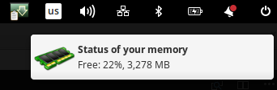
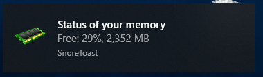

# Memory Usage Checker (MUC)

Do you have the problem that your ram memory is getting full?
This cross platform tool (Linux, macOS, Windows) will notify you about an increased memory usage and you can intervene in time.
The higher the memory usage the more frequently MUC will remind you.




| Free memory [%] | Frequency of notification |
|:---------------:|:-------------------------:|
| 100             | 60 minute                 |
| 50              | 30 minute                 |
| 20              | 10 minute                 |
| 10              | 5 minute                  |
| 5               | 1 minute                  |
| 2               | 30 second                 |

## Install

```
$ npm install -g muc
```

## Run

```
$ muc
```
